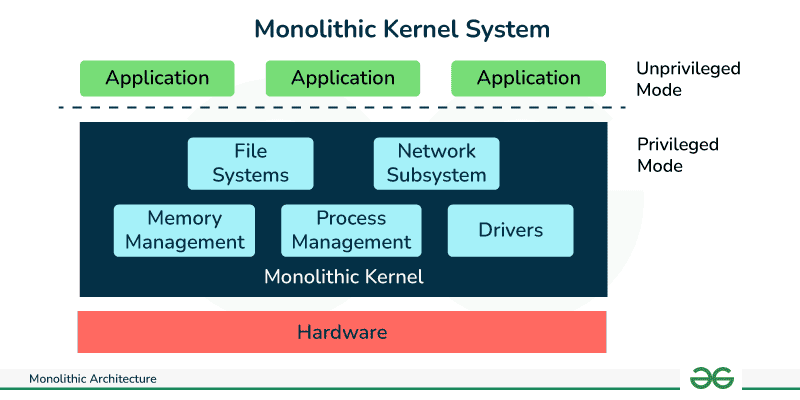
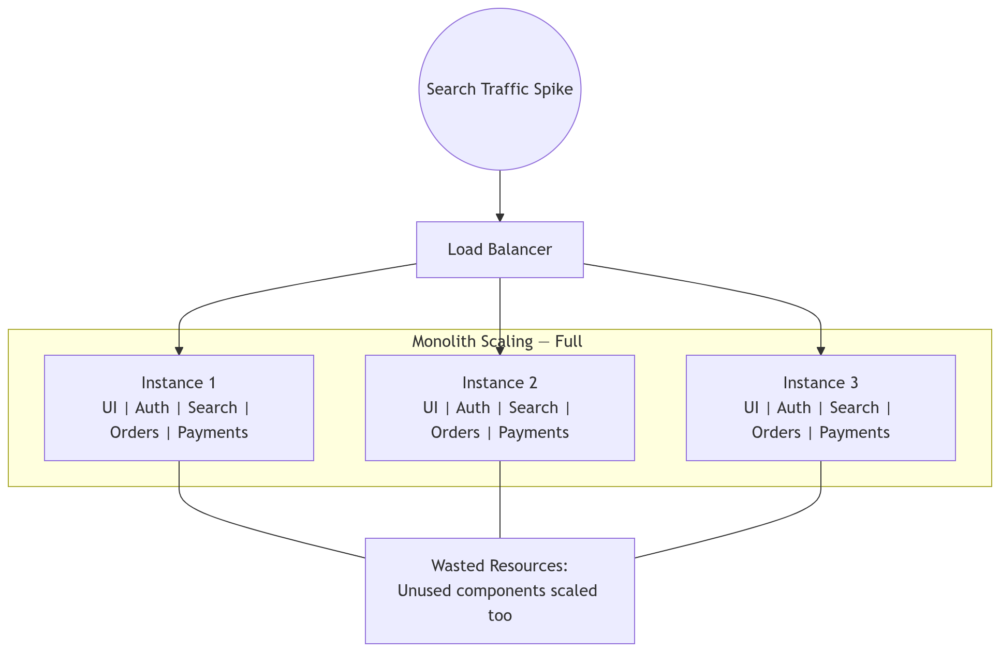
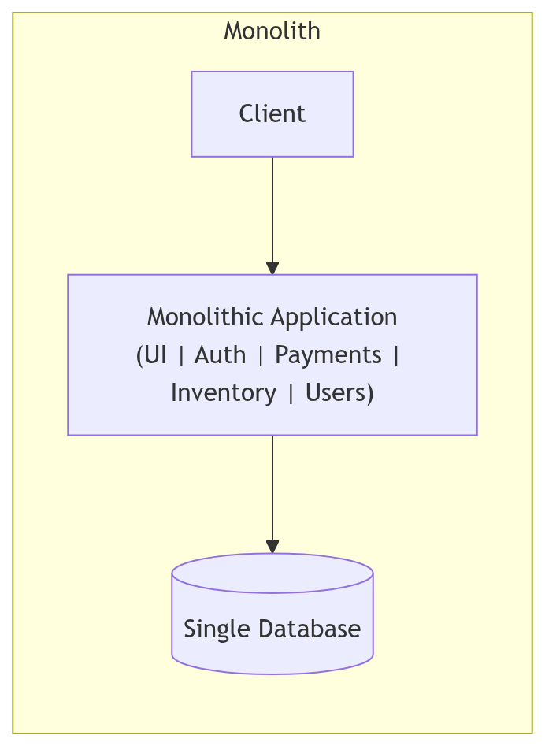
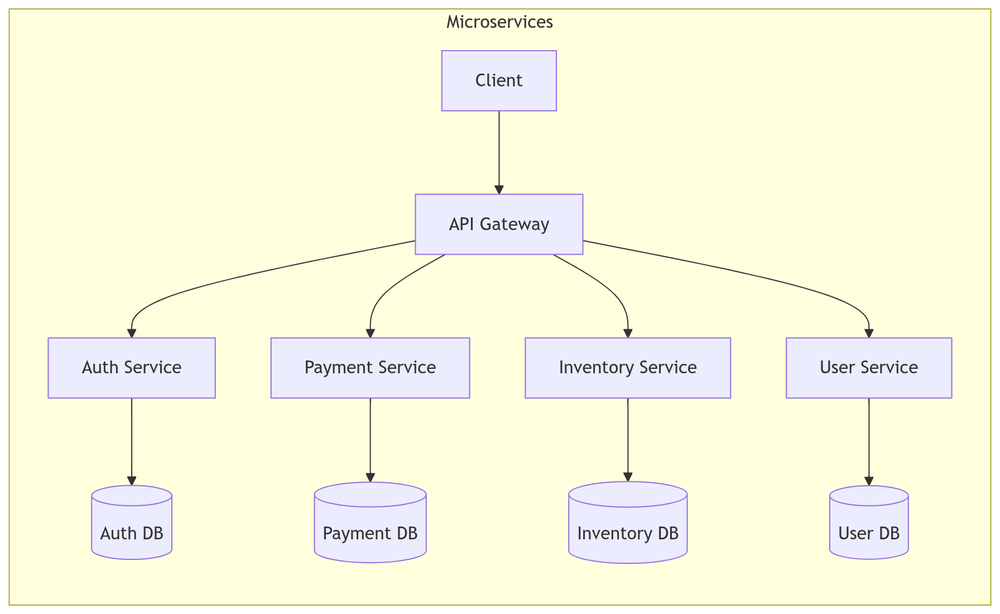
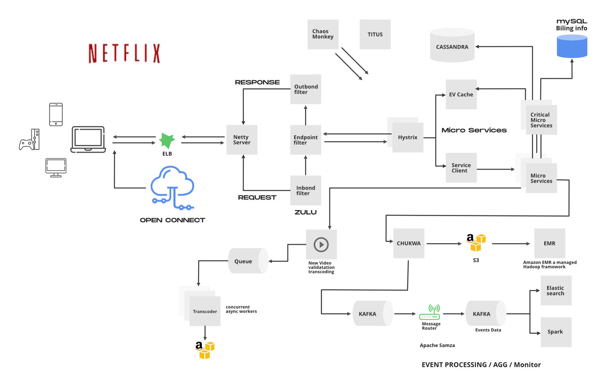
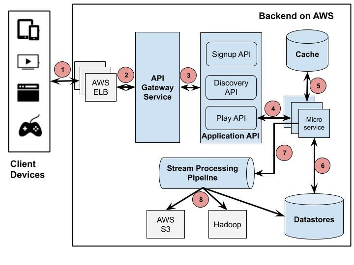
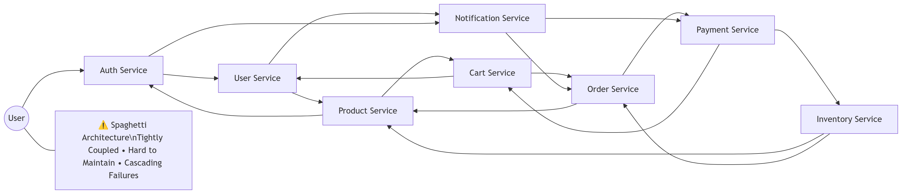

## What Is a Monolithic System?

A monolithic system is a single, all-in-one application where every feature — login, payments, user interface, database access — lives inside one unified codebase and is deployed as a single unit.

Think of it like a giant cake. If you want to change the frosting, you still have to bake the whole thing again.

[https://media.geeksforgeeks.org/wp-content/uploads/20231228170233/Monolithic-Architecture.png](https://media.geeksforgeeks.org/wp-content/uploads/20231228170233/Monolithic-Architecture.png)

**Example:**\
An e-commerce website where product listings, shopping cart, checkout, and user accounts all exist in the same application. If you update the checkout process, you redeploy the entire system — even if nothing else changed.

This approach works beautifully in the beginning. It’s simple. It’s fast to build. Debugging is straightforward because everything runs in one place.

But as the application grows, cracks start to appear. Updates slow down. Scaling becomes painful. One overloaded feature — say search during a sale — can strain the entire system. A single bottleneck drags everything with it.

And that’s when teams begin looking for alternatives.

---

## What Is Microservices Architecture?

Microservices architecture breaks a large application into smaller, independent services. Each service focuses on doing one thing well — user authentication, payments, inventory, recommendations — and communicates with others through APIs.

Instead of one giant cake, you now have individual cupcakes. You can change one without touching the others.

For example, in an online store:

* The **User Service** manages logins and profiles
* The **Payment Service** processes transactions
* The **Inventory Service** tracks stock levels

Each service runs independently. It can use its own technology stack. It can be deployed separately. It can scale separately.

If the payment service fails, the rest of the application doesn’t necessarily collapse.&#x20;

That isolation improves resilience. Teams can also work in parallel, shipping updates faster because they’re not stepping on each other’s toes.

Of course, this flexibility introduces complexity. Distributed systems are harder to manage. But when scale becomes serious, that trade-off often makes sense.

---

## Why Microservices Change the Autoscaling Equation

Now let’s talk about scaling — because this is where microservices truly shine.

Autoscaling means automatically adjusting computing resources based on traffic or demand. Cloud platforms like AWS, Google Cloud, and Azure allow systems to add or remove servers based on CPU load, request rate, or latency.

&#x20;\
In a monolithic system, scaling is blunt. If one feature experiences heavy load — imagine the search function during a festival sale — you must scale the entire application. Even parts that aren’t under stress get duplicated. That wastes infrastructure and money.

Microservices make scaling surgical.

Only the services under pressure need more instances. For example:

* During a flash sale, **checkout** and **inventory** might scale aggressively
* The **user profile** service might remain unchanged
* Idle services can run on smaller machines

This precision scaling reduces waste, lowers costs, and improves performance under peak demand. Instead of throwing hardware at the whole system, you target exactly what needs attention.

It’s efficient. It’s flexible. And at large scale, it’s often essential.

---

## Case Study: How Netflix Made the Shift

[https://media.geeksforgeeks.org/wp-content/cdn-uploads/20210128214233/Netflix-High-Level-System-Architecture.png](https://media.geeksforgeeks.org/wp-content/cdn-uploads/20210128214233/Netflix-High-Level-System-Architecture.png)

In its early days, Netflix ran as a monolithic system inside traditional data centers. That worked — until it didn’t.

As global traffic surged and streaming demand became unpredictable, scaling a single monolith became risky and slow. Outages were costly. Deployments were stressful.

Netflix migrated to Amazon Web Services and redesigned its system into hundreds of independent microservices — handling streaming, recommendations, billing, content encoding, and more.

This shift allowed them to:

* Scale streaming services during peak viewing hours
* Isolate failures so one issue wouldn’t take down the entire platform
* Deploy updates continuously without full-system redeployments
* Improve resilience using tools like Chaos Monkey, which intentionally simulates service failures

That last point matters. Netflix didn’t just move to microservices — they embraced failure as part of the design.

The result? A system capable of serving millions of concurrent users worldwide with high availability. Scalability wasn’t just a technical upgrade. It became a business advantage.

Companies like Amazon, Uber, and Spotify followed similar paths, proving that architectural decisions can directly influence revenue, reliability, and growth.

---

## When Microservices Are NOT the Right Choice

Here’s the part people sometimes gloss over: microservices aren’t always the answer.

They introduce operational complexity. You now manage distributed communication, service discovery, monitoring, and orchestration tools like Kubernetes. That’s not trivial.

Microservices may not be ideal when:

**1. The application is small or early-stage**\
A monolith is faster to build and easier to maintain.

**2. The team lacks DevOps maturity**\
You’ll need automated deployments, monitoring systems, and strong infrastructure skills.

**3. Strong consistency is critical**\
Distributed systems introduce latency, synchronization challenges, and eventual consistency concerns.

**4. Scaling patterns are uniform**\
If every part of the system grows at the same rate, targeted scaling offers little advantage.

In many real-world scenarios, companies start with a monolith — and only break it apart once scaling challenges justify the effort.

Sometimes simplicity wins. And that’s okay.

---

## Conclusion

Monolithic architecture offers simplicity, speed, and clarity in the early stages of development. It’s practical and efficient when systems are small.

Microservices, on the other hand, provide modularity, fault isolation, and precise autoscaling — benefits that become powerful as systems grow.

But here’s the real takeaway: the question isn’t “Which architecture is better?”

It’s “How much complexity can your system — and your team — handle right now?”

Architecture is a business decision as much as a technical one. The right choice depends on scale, traffic patterns, team maturity, and long-term vision.

Sometimes a single, well-built system is enough.

And sometimes, you need cupcakes instead of cake.
