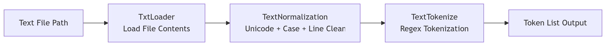
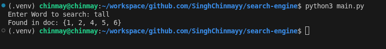
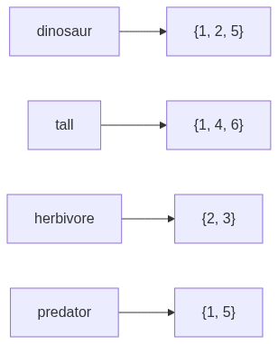

# TLDR

Built a modular NLP search pipeline with clear separation between ingestion, preprocessing, and indexing. After designing the internal pipeline structure, I wired everything together through a main entry point that assigns document IDs and constructs a working inverted index. We now have a clean architecture and a basic keyword lookup system ready to grow.

🔗 [**View the source code on GitHub**](https://github.com/SinghChinmayy/search-engine)

---

# Stage 1: Designing the Pipeline Before Writing Code

What happened here

I did not want to write just another script that reads files and prints words. That works for about five minutes. Then it becomes chaos.

So I started with structure.

Before even thinking about indexing or querying, I designed the internal pipeline. Think of it like building a factory floor layout before buying any machines. Sources feed into ingestion. Ingestion feeds preprocessing. Preprocessing produces tokens. Representation will come later.

I wanted each stage to be isolated. Loaders should not know about indexing. Tokenizers should not care about file paths. It is like hiring people for specific jobs, and they only focus on what they are good at.

Here is the thing: if you separate concerns early, future upgrades hurt less. You do not end up rewriting everything when you add ranking or crawling later.

The folder structure reflects that thinking.

```
pipeline/
    loaders/
    processor/
    pipeline_manager.py
```

### Worth noting

> This separation matters more than people realize. Real systems do not mix file reading logic with indexing logic. Once you start scaling, that discipline saves you hours of debugging.

---

# Stage 2: Building the Internal Processing Flow



### What happened here

After defining the structure, I implemented the internal pieces.

The loader reads text files. The normalizer cleans text. The tokenizer converts text into tokens. Each module does exactly one thing.

I kept them independent so that the pipeline manager could orchestrate them without tightly coupling everything. That way, calling `pipeline(file_path).tokens()` becomes the clean interface for the rest of the system.

Let me walk through the pipeline manager:

```python
class pipeline:
    def __init__(self, path):
        self.path = path

    def tokens(self):
        input_text = TxtLoader(self.path)
        normalized = TextNormalization(input_text.load()).normalize()
        tokens = TextTokenize(normalized).tokenize()
        return tokens
```

Honestly, this small design choice is what makes the system readable and extensible. The rest of the codebase can just call `.tokens()` and not worry about what is happening underneath.

---

# Stage 3: Connecting Everything Through the Main Entry Point

Once the pipeline worked internally, I needed something to drive it.

That is where `main.py` comes in.

Instead of writing indexing logic inside the pipeline modules, I kept the pipeline pure and used the main function as the coordinator. You know what? It is like having a conductor in an orchestra. The musicians know their parts, but someone needs to bring them together.

Next question: how do I fetch documents cleanly?

Instead of using older file handling patterns, I used `pathlib`. It keeps file system logic readable and expressive. If ingestion is messy, everything downstream becomes fragile.

So I defined the dataset folder and iterated through each file.

```python
from pathlib import Path
from pipeline.pipeline_manager import pipeline

folder = Path("dataset/.txt_type")

for file_path in folder.iterdir():
    if file_path.is_file():
        tokens = pipeline(file_path).tokens()
        print(f"\n{file_path}:\n {tokens}\n")
```

> If your dataset grows, consider sorting file paths before assigning document IDs. Otherwise document IDs may change between runs.

---

# Stage 4: Cleaning Text Like It Actually Matters

### What happened here

Raw text is chaotic. Different encodings. Strange characters. Mixed line endings. It is like trying to organize a messy kitchen before you can cook anything useful.

Let me explain what I did.

I used Unicode normalization in NFKC format. That standardizes characters across different representations. Then I normalized line endings so Windows, Mac, and Linux formats all behave the same. Then I lowercased everything, because search should not care whether you typed "Dinosaur" or "dinosaur." Then I stripped whitespace.

```python
import unicodedata

class TextNormalization:
    def __init__(self, text):
        self.text = text

    def normalize(self):
        text = unicodedata.normalize("NFKC", self.text)
        text = text.replace("\r\n", "\n").replace("\r", "\n")
        text = text.lower()
        text = text.strip()
        return text
```

> \[!note]
> Stemming and lemmatization are not implemented yet. Stopword removal is also pending. I wanted the core stable before adding linguistic intelligence.

### Worth noting

Think about tokens like "cafe", "naive", and "resume." Unicode handling is not theoretical. It shows up immediately in real text.

---

# Stage 5: Tokenization Decisions That Shape Search


### What happened here

I had two options. Use `.split()` or use regex.

Split is easy. But it fails quickly. It cannot handle edge cases like hyphenated words or contractions. It is like using a butter knife to chop vegetables: technically possible, but you will not be happy with the results.

So I used regex:

```python
import re

class TextTokenize:
    def __init__(self, text):
        self.text = text

    def tokenize(self):
        tokens = re.findall(r"\b\w+(?:[-']\w+)*\b", self.text)
        return tokens
```

This pattern `\b\w+(?:[-']\w+)*\b` keeps normal words, hyphenated words, and words with apostrophes.

But here is the interesting part. You will notice cases like "google's" becomes "google" and "s", and "don't" becomes "don" and "t." That is not wrong. It is tokenizer behavior. Every search engine makes tradeoffs here.

Tokenization is not about perfection. It is about consistency.

> \[!warning]
> This stage defines how your entire index behaves. If tokenization is flawed, ranking and querying will suffer later.

---

# Stage 6: Assigning Document IDs in the Main Coordinator



### What happened here

Now that the pipeline could generate tokens, I extended the main function.

Instead of just printing tokens, I started assigning document IDs. This keeps indexing logic outside the processing modules. It is like adding serial numbers to files in a cabinet rather than stamping them during production.

```python
doc_id = 0
doc_table = {}

for file_path in folder.iterdir():
    if file_path.is_file():
        tokens = pipeline(file_path).tokens()
        doc_id += 1
        doc_table[doc_id] = {
            "path": str(file_path)
        }
```

### Output

```
{1: {'path': 'dataset/.txt_type/t-rex.txt'}, 2: {'path': 'dataset/.txt_type/stegosaurus.txt'}, ...}
```

This mirrors how real search engines separate document metadata from term storage.

---

# Stage 7: Building the Inverted Index



### What happened here

Now comes the core of search.

Once tokens and document IDs were available in the main flow, building the inverted index became straightforward. Think of it like a book index at the back: you look up a word and it tells you which pages mention it.

The structure is simple. A dictionary where each term maps to a set of document IDs.

Why a set? Because I do not care how many times a word appears. I just care that it exists in a document. Using a set automatically prevents duplicates. Clean and efficient.

```python
inverted_index = {}

for term in tokens:
    if term not in inverted_index:
        inverted_index[term] = set()
    inverted_index[term].add(doc_id)
```

> \[!note]
> Notice how words like "the" and "a" appear in almost every document. That is why stopword removal becomes important later.

---


# Stage 8: Basic Keyword Lookup


### What happened here

Once the inverted index was ready, querying became simple. This is the payoff moment where you can actually search for something and get results back.

```python
query = input("Enter Word to search: ")

if query in inverted_index:
    print("Found in doc:", inverted_index[query])
else:
    print("No result found")
```

### Output

```
Enter Word to search: tall
Found in doc: {1, 2, 4, 5, 6}
```

Single term lookup works. It is basic, but it is real. Next comes boolean logic and ranking.

---

# Summary

The important shift here was architectural.

First, I built a modular pipeline with clear separation between loaders, processors, and the manager. Then I created a main entry point that orchestrates everything. Then I layered indexing on top, followed by a basic lookup.

This separation keeps the system clean. Each piece can evolve independently. Want to swap the tokenizer? Change one file. Want to add a new file format? Write a new loader. Nothing else breaks.

We are not just parsing text anymore. We are building a search engine foundation.

---

# Implementation Checklist

### Done in this phase

* \[x] Pipeline architecture designed with clear separation of concerns
* \[x] Text file loader (`TxtLoader`) with UTF-8 encoding support
* \[x] Text normalization with Unicode NFKC, line ending normalization, lowercasing, and whitespace stripping
* \[x] Regex-based tokenizer that handles hyphenated words and contractions
* \[x] Pipeline manager that orchestrates loader, normalizer, and tokenizer
* \[x] Main entry point using `pathlib` for file iteration
* \[x] Document ID assignment and document table creation
* \[x] Inverted index construction (term to set of doc IDs)
* \[x] Basic single keyword lookup

### Possible future implementations

* \[ ] Stopword removal
* \[ ] Stemming and lemmatization
* \[ ] Punctuation handling in normalizer
* \[ ] TF-IDF or BM25 ranking
* \[ ] Boolean query support (AND, OR, NOT)
* \[ ] Multi-word query processing
* \[ ] Sorted file paths for consistent document IDs across runs
* \[ ] Support for additional file formats (PDF, HTML, JSON)
* \[ ] Wikipedia dump ingestion via web crawler
* \[ ] CLI search interface
* \[ ] Web UI for search
* \[ ] Semantic search with embeddings
* \[ ] Hybrid search (keyword + semantic)
